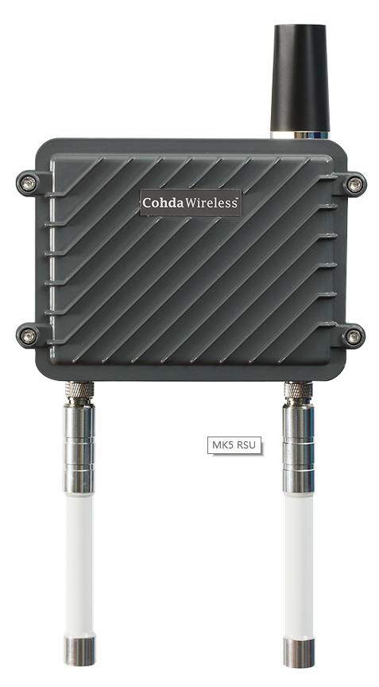
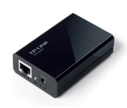
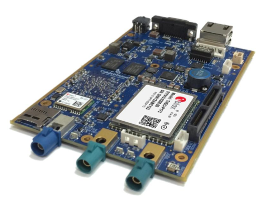
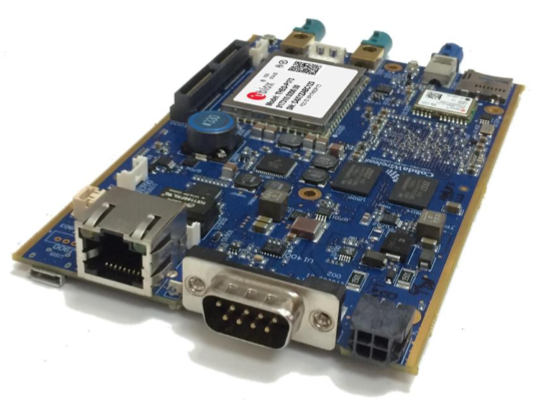
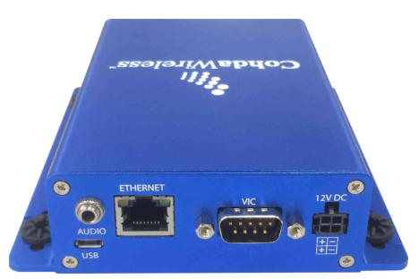
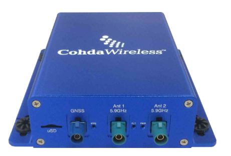
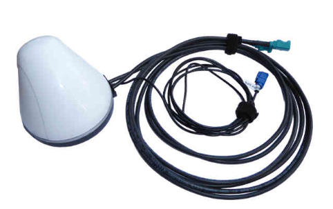
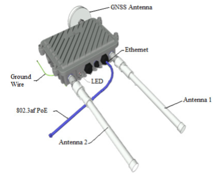
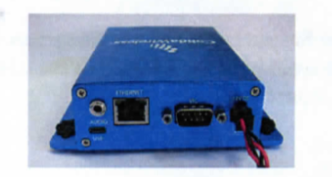
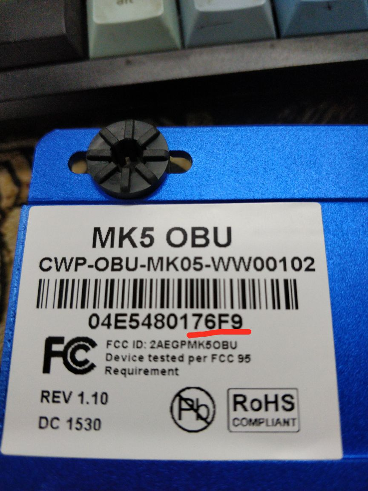

# DSRC-Tutorial

Cohda wireless, DSRC tutorial, RSU, OBU, CQU-BDSC

## 目录

> [0 阅读指南](#0-阅读指南)  
> [1 DSRC 设备简介](#1-dsrc-设备简介)  
> [1.1 MK5 RSU](#11-mk5-rsu)  
> [1.2 MK5 OBU](#12-mk5-obu)  
> [2 设备使用指南](#2-设备使用指南)  
> [2.1 将DSRC设备连接上PC](#21-将dsrc设备连接上pc)  
> [2.2 更改设备初始IP](#22-更改设备初始ip)  
> [2.3 上下位机通信设置](#23-上下位机通信设置)  
> [2.4 其他说明](#24-其他说明)  
> [3 其他资源](#3-其他资源)   
> [3.1 其他文档](#31-其他文档)  
> [3.2 在线资源](#32-在线资源)  
> [4 致谢](#4-致谢)
  
## 0 阅读指南

这是一篇关于如何使用 _Cohda wireless_ 公司的Dedicated Short Range Communications（**DSRC**, 短程专用通讯）设备（包括On Board Unit, 即车载单元**OBU** 与RoadSide Unit, 即路侧单元 **RSU** ）教程。本文的写作的前提是假设读者有一定的车联网知识，其中包括DSRC等Vehicle to vehicle，**V2V**通信知识。

## 1 DSRC 设备简介

### 1.1 MK5 RSU

#### 1.1.1 外观



#### 1.1.2 产品构成

1. RSU 本体

   

2. GNSS 天线
  
    
   
   GNSS是全球导航卫星系统，主要用来接收导航卫星信号，支持的系统有GPS与GLONASS。

3. DSRC 天线
  
    
   
   两个DSRC 5.9Ghz的天线。

4. 固定绑带
   
   

5. 固定底座
   
   

6. 防水网线接口
   
   

#### 1.1.3 技术细节

1. 符合标准
   
   - IEEE 802.11
   - IEEE 1609
   - SAE J2735
   
2. 带宽
   
   10MHz
   
3. 速率
   
   3-27 Mbps
   
4. 操作系统
   
   Linux 3.10.17
   
5. 接收敏感性
   
   \-99 dBm @ 3 Mbps
   
6. 频段
   
   5.9Ghz
   
7. 最大功率
   
   \+22 dBm
   
8. GNSS定位精度
   
   2.5m 最佳
   
9. 移动性与时延
   
   800 km/h
   1500ns
   
10. 供电
     


使用POE以太网供电，RSU同时通过以太网接口传输数据与供电。

#### 1.1.4 内部构造

> MK5 RSU 与 OBU 使用相同的集成板，只是外观上不一样。




故RSU和OBU 内部为运行Linux系统（ Ubuntu 16.04 LTS）的集成板，不过支持了**DSRC**通信协议，可以利用DSRC进行V2V以及V2I通信。

### 1.2 MK5 OBU

#### 1.2.1 外观


#### 1.2.2 产品构成

1. OBU 本体

   
   

2. DSRC与GNSS集成天线

   

3. 电源线

   

#### 1.2.3 技术细节

1. 符合标准
   
   - IEEE 802.11
   - IEEE 1609
   - SAE J2735
   
2. 带宽
   
   10MHz
   
3. 速率
   
   3-27 Mbps
   
4. 操作系统
   
   Linux 3.10.17, Ubuntu 16.04 LTS
   
5. 接收敏感性
   
   \-99 dBm @ 3 Mbps
   
6. 频段
   
   5.9Ghz
   
7. 最大功率
   
   \+22 dBm
   
8. GNSS定位精度
   
   2.5m 最佳
   
9. 移动性与时延
   
   800 km/h
   1500ns
   
10. 供电
    
    12V 直流电

## 2 设备使用指南

### 2.1 将DSRC设备连接上PC

#### 2.1.1 RSU



将RSU 与其他部件如上图连接，通过POE供电。POE供电说明图如下。


白色网线连接POE口，连接在RSU上的RJ45接口上，而黄线连接PC上的RJ45接口。

#### 2.1.2 OBU




以上两图说明了OBU与天线和电源的连接，OBU是通过12V 的直流电进行供电，而与PC的连接是直接通过网线连接。

### 2.2 更改设备初始IP

以上为PC与OBU、RSU的物理连接，因为RSU、OBU内部是一样的，之后对OBU与RSU的操作均相同，故不作区分。

#### 2.2.1 设备初始IP

为了方便以后对设备的使用，我们现在将执行以下操作更改设备的初始IP。
设备的初始IP定义如下，IP地址为**169.254.ABC.DEF**，其中IP地址的后六位由设备上的设备串码后四位的**16进制值**确定。



例如，**76F9**转换为IP地址后，即为169.254.**118.249**

#### 2.2.2 更改初始IP

PC与DSRC设备应在同一局域网下才可以进行远程登陆到设备中的系统，故将PC的IP地址设置为同一网段后，就可通过终端命令，若PC运行的是Windows 操作系统，可使用Xshell工具运行终端命令

```bash
sudo ssh user@169.254.ABC.DEF
```

即可登陆上设备中的Ubuntu系统，其中 _用户名是 **user**，密码是 **user**_，IP地址由2.2.1获取。
通过以下命令可以更改初始IP为**192.168.1.80**

```bash
sudo fw_setenv static_ip_addr "192.168.1.80"
sudo fw_setenv static_ip_mask "255.255.255.0"
sudo fw_setenv static_ip_bcast "192.168.1.255"
sudo fw_setenv static_ip_gw "192.168.1.1"
sudo fw_setenv static_ip_ns "192.168.1.2"
```
    

#### 2.2.3 登陆设备

经过以上操作之后，我们就可以通过**192.168.1.80**来远程登陆DSRC设备了。同时，设备的初始IP也是可以使用的。

```bash
sudo ssh user@192.168.1.80
```


### 2.3 上下位机通信设置

在PC与DSRC设备的通信过程中，PC被称为上位机，而DSRC设备为下位机，上下位机的通信过程是由**bsm-shell**这个程序实现的，即当DSRC设备接收到其他DSRC设备发送的数据时，通过UDP协议发送给PC, 而当DSRC设备接收到PC发送的UDP报文时，通过DSRC协议广播出去。

#### 2.3.1 拷贝bsm-shell文件

通过以下终端命令，将PC（Linux）当前文件夹中的bsm-shell文件拷贝到目标DSRC设备中的 /home/duser/目录下。

```bash
sudo scp bsm-shell user@192.168.1.80:/home/duser
```

#### 2.3.2 运行bsm-shell文件

登陆设备后，跳转到 /home/duser/目录，执行以下命令

```bash
D_LEVEL=4 ./bsm-shell -m 1 -c 178 -b 172 -n 172 -i 1 –f/dev/null –u 192.168.1.83 -y 4040 -z 4040
```

该命令的参数说明可由 `bsm-shell?` 显示。

#### 2.3.3 开机自启动bsm-shell

经过以上配置后，PC就能通过接收与发送UDP报文，间接使用DSRC协议与其他DSRC设备进行通信，而当设备重启后，又需要重新运行bsm-shell，如方便起见，我们将bsm-shell添加到设备的自启动项。
我们将**rc.local**文件拷贝到目标DSRC设备中的/home/duser/目录中

```bash
sudo scp rc.local user@192.168.1.80:/home/duser
```

然后将该文件放到/mnt/ubi 目录中

```bash
sudo cp rc.local /mnt/ubi
```

这样，每次开机启动后就会自动运行bsm-shell文件。

### 2.4 其他说明

以上说明中的bsm-shell与rc.local文件均可在files 文件夹中获取。

## 3 其他资源

### 3.1 其他文档

1. [MK5_OBU 简介](https://github.com/cqu-bdsc/DSRC-Tutorial/blob/master/docs/MK5_OBU.pdf)
2. [MK5_OBU 详细文档](https://github.com/cqu-bdsc/DSRC-Tutorial/blob/master/docs/MK5_OBU_Specification.pdf)
3. [MK5_OUB 快速入门](https://github.com/cqu-bdsc/DSRC-Tutorial/blob/master/docs/Quickstart%20Guide%20MK5%20OBU%20V0.1.pdf)
4. [MK5_RSU 简介](https://github.com/cqu-bdsc/DSRC-Tutorial/blob/master/docs/MK5_RSU.pdf)
5. [MK5_RSU 详细文档](https://github.com/cqu-bdsc/DSRC-Tutorial/blob/master/docs/MK5_RSU_Specification.pdf)
6. [MK5_RSU 快速入门](https://github.com/cqu-bdsc/DSRC-Tutorial/blob/master/docs/Quickstart%20Guide%20MK5%20RSU%20V0.1.pdf)

以上文档均可在docs 文件夹中获取。

### 3.2 在线资源

访问[Cohda Wireless Support](https://support.cohdawireless.com/)，需要注意的是该网站需要账户密码登陆后才有访问资源权限。我们实验室的同学如果有访问资源的需求，可用邮箱联系[Near](
mailto:singleangel@vip.qq.com)。

## 4 致谢

最后，感谢大家抽出时间阅读本文档，我也深知一份好文档应该由大家一起来维护，如果发现文中有错误，请各位同学自行更正。也希望以后有新内容也可以添加上去。

